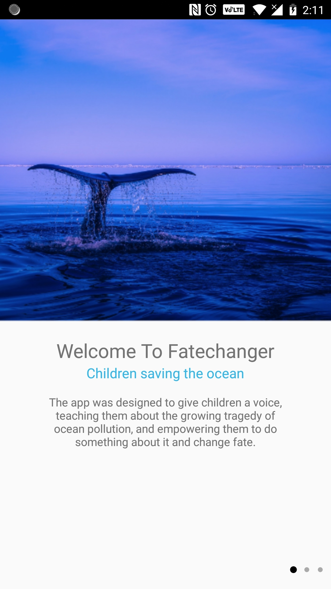
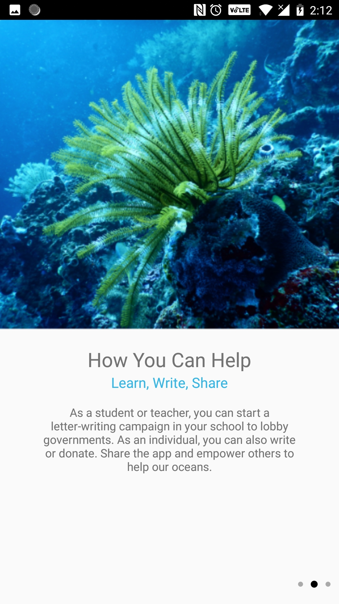
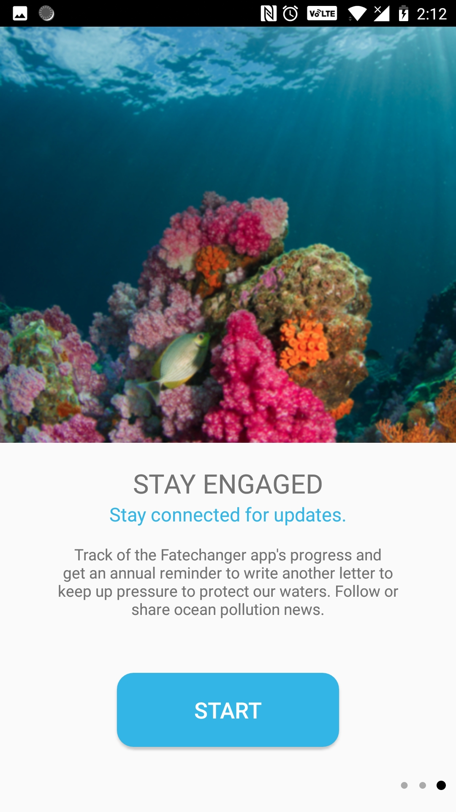
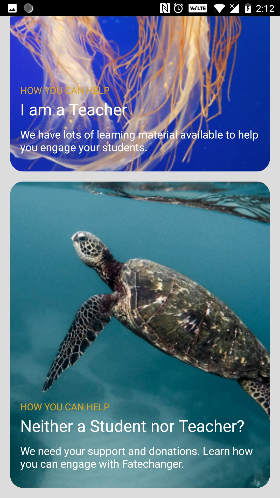
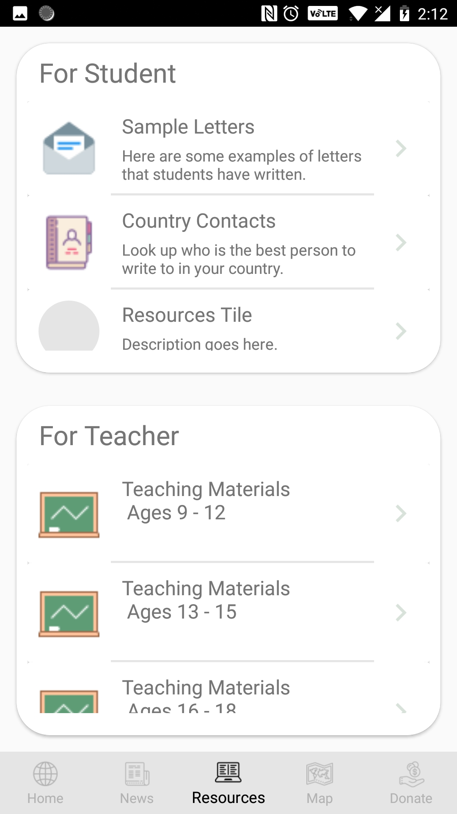
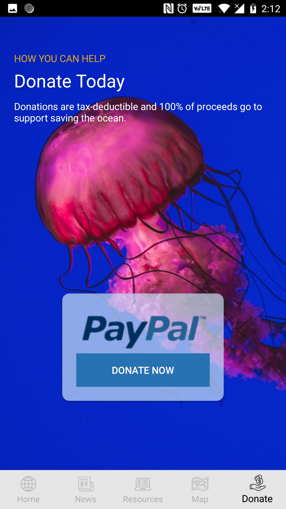

# Fate Changer

## Table Of Contents
1. [Introduction](#introduction)
2. [Screenshots](#screenshots)
3. [Project Requirements](#project-requirements)

### Introduction

The purpose of the Fate Changer mobile app is to help spur a global children's letter-writing campaign to pressure governments to act now on ocean pollution.

The app is mainly targets towards students and teachers, but also invites the wider global community to help.

[Back to Top](#table-of-contents)

___

### Screenshots

 


 

  

[Back to Top](#table-of-contents)


___

### Project Requirements

You can find a rough design for the app [here](https://marvelapp.com/53f9fh3).

If necessary, click on the Show Grid View button on the bottom left to see all of the wireframes for each of the screens.

```
Onboarding – brief introduction, linked to cards on new Home page
    10.10
    10.11
    10.12
    
User Identification – shown only once – routes them to their version of intro video
    20.10
    20.11
    20.12
    
Intro Video: explains for all users the app’s purpose and shows them where they can find the app’s resources relevant their needs (e.g. letter-writing, teaching, etc.).
    Intro video student
    Intro video teacher
    Intro video other type of user
    
Home – tracks their own letter writing, cards blinking if new content is available (e.g. map card blinks when new country added, top 10 card blinks when there’s a new leader, letter writing card blinks if there’s a call to write another letter, etc.).
    Home screen
News and Media combined – content needs to be easily editable by me. Is linking to a web site the best solution to give ease of use for me and a beautiful, clean interface for the user?

    60 News and Media
Donation – linked to web site

    40.00 Donate
Resources for all users

    50 Resources
Map – allows tracking of letters written and progress made. Anan’s design Map

Top 10
    Top 10 countries who have people writing letters.
```
[Back to Top](#table-of-contents)

___
